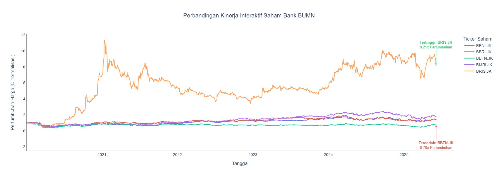
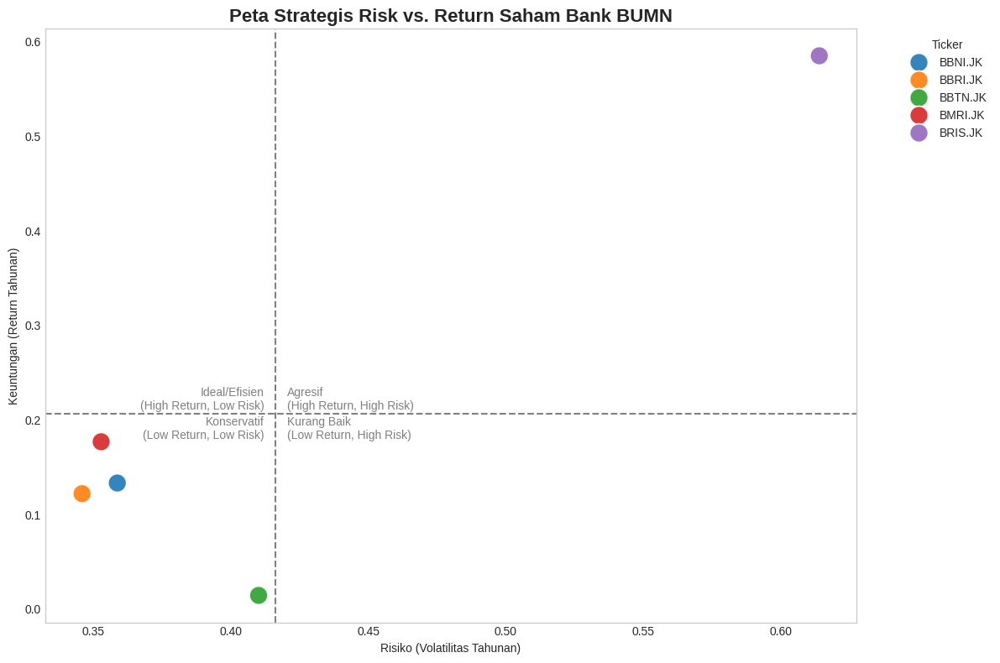
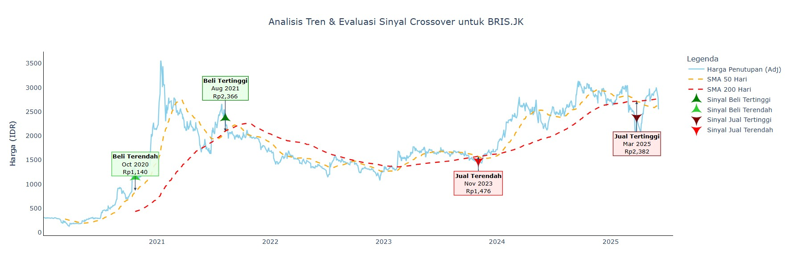

# Analisis Komparatif Saham Perbankan BUMN (2020 - 2025)

## 📜 Deskripsi Proyek

Proyek ini merupakan analisis data mendalam untuk membandingkan kinerja, risiko, dan tren dari lima bank BUMN terbesar di Indonesia. Tujuannya adalah untuk mengidentifikasi "kepribadian" investasi dari setiap saham dan memberikan *insight* berbasis data yang dapat membantu pengambilan keputusan strategis.

**Bank yang Dianalisis:**
* Bank Mandiri (BMRI.JK)
* Bank Rakyat Indonesia (BBRI.JK)
* Bank Negara Indonesia (BBNI.JK)
* Bank Tabungan Negara (BBTN.JK)
* Bank Syariah Indonesia (BRIS.JK)

---

## 🚀 Insight Kunci & Temuan Utama

Berikut adalah beberapa temuan paling signifikan dari analisis ini:

1.  **Dominasi Absolut BRIS.JK:** Saham **BRIS.JK** menunjukkan kinerja yang fenomenal, tumbuh lebih dari 8 kali lipat **(8.21x)** sejak awal 2020, jauh melampaui semua bank BUMN lainnya.
2.  **Risiko di Balik Pertumbuhan:** Pertumbuhan masif BRIS.JK juga diiringi dengan volatilitas tertinggi, menjadikannya aset dengan profil *High-Risk, High-Return*.
3.  **Pentingnya Sinyal Pertumbuhan:** Analisis *moving average crossover* pada BRIS.JK secara efektif menunjukkan sinyal `Golden Cross` sebagai pemicu awal dari tren naik yang eksplosif.
4.  **Kinerja yang Tertinggal:** **BBTN.JK** menjadi saham dengan kinerja terendah, bahkan nilainya sedikit menurun (-21%) selama periode analisis.

---

## 🛠️ Tools & Libraries

* **Pengumpulan Data:** `yfinance`
* **Analisis & Manipulasi Data:** `pandas`, `numpy`
* **Visualisasi Data:** `matplotlib`, `seaborn`, `plotly`
* **Lingkungan Kerja:** Jupyter Notebook

---

## 📊 Visualisasi Kunci

Berikut adalah tiga visualisasi utama dari proyek ini yang merangkum temuan paling penting.

#### 1. Perbandingan Kinerja: Kisah Dominasi Satu Saham
*Grafik ini secara dramatis menunjukkan dominasi absolut BRIS.JK yang meroket dengan pertumbuhan lebih dari 700%, menciptakan jarak yang sangat jauh dengan saham lainnya.*

#### 2. Peta Strategis Risk vs. Return
*BRIS.JK jelas menempati kuadran 'Agresif/Spekulatif' dengan Return dan Risiko tertinggi. Visualisasi ini membantu memetakan profil setiap saham untuk strategi investasi yang berbeda.*

#### 3. Studi Kasus Tren BRIS.JK: Anatomi Pertumbuhan Eksplosif
*Analisis mendalam pada BRIS.JK menunjukkan sinyal 'Golden Cross' sebagai titik awal dari tren naik masif, membuktikan kegunaan analisis teknikal untuk mengidentifikasi peluang pertumbuhan.*

---

##  Notebook
Untuk melihat proses analisis lengkap, mulai dari pembersihan data, *feature engineering*, hingga visualisasi, silakan lihat file [**Analisis Bank BUMN**](Analisis_Bank_BUMN.ipynb).

---

## 📞 Kontak
* **LinkedIn:** [Muhammad Zulfarhan](https://www.linkedin.com/in/muhammad-zulfarhan-1b3921206/)
* **Email:** zulfarhan2102@gmail.com
