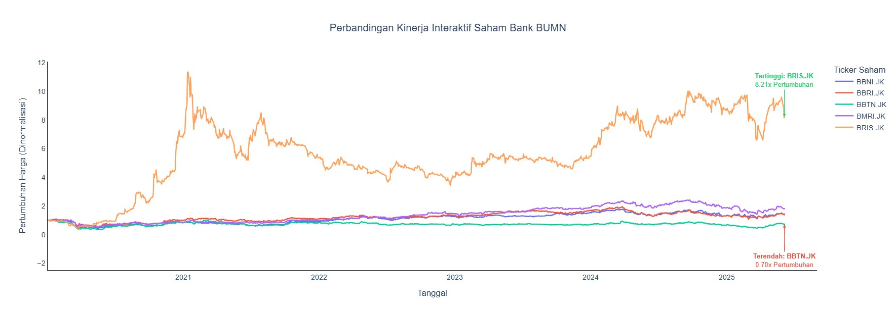
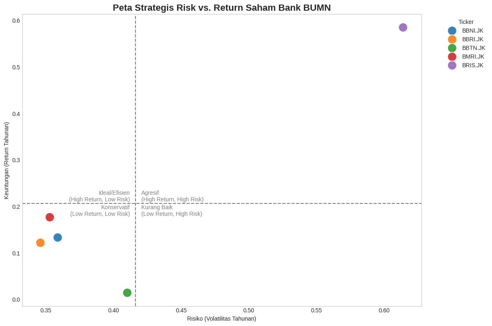
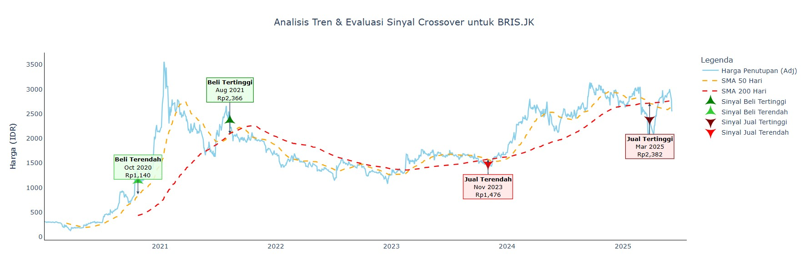

# Analisis Komparatif Saham Perbankan BUMN (2020 - 2025)

## 📜 Deskripsi Proyek

Proyek ini merupakan analisis data mendalam untuk membandingkan kinerja, risiko, dan tren dari lima bank BUMN terbesar di Indonesia. Tujuannya adalah untuk mengidentifikasi "kepribadian" investasi dari setiap saham dan memberikan *insight* berbasis data yang dapat membantu pengambilan keputusan strategis.

**Bank yang Dianalisis:**
* Bank Mandiri (BMRI.JK)
* Bank Rakyat Indonesia (BBRI.JK)
* Bank Negara Indonesia (BBNI.JK)
* Bank Tabungan Negara (BBTN.JK)
* Bank Syariah Indonesia (BRIS.JK)

---

## 🚀 Insight Kunci & Temuan Utama

Berikut adalah beberapa temuan paling signifikan dari analisis ini:

1.  **Pembalikan Tren Kinerja:** Terjadi perubahan drastis dimana **BBNI.JK** kini memimpin pertumbuhan terkini, menyalip **BRIS.JK** yang sebelumnya dominan namun mengalami koreksi tajam.
2.  **Profil Risiko yang Berbeda:** Setiap saham memiliki profil risiko yang unik. **BRIS.JK** menunjukkan volatilitas tertinggi, sementara **BBRI.JK** menjadi yang paling stabil.
3.  **Pentingnya Sinyal Teknikal:** Analisis *moving average crossover* pada BRIS.JK secara efektif menunjukkan sinyal `Death Cross` sebagai peringatan dini sebelum tren turun yang signifikan terjadi.

---

## 🛠️ Tools & Libraries

* **Pengumpulan Data:** `yfinance`
* **Analisis & Manipulasi Data:** `pandas`, `numpy`
* **Visualisasi Data:** `matplotlib`, `seaborn`, `plotly`
* **Lingkungan Kerja:** Jupyter Notebook

---

## 📊 Visualisasi Kunci

Berikut adalah tiga visualisasi utama dari proyek ini yang merangkum temuan paling penting.

#### 1. Perbandingan Kinerja: Sebuah Kisah Pembalikan Tren
*Grafik ini menunjukkan bagaimana BBNI mengambil alih posisi sebagai pemimpin pertumbuhan dalam periode terakhir, menyalip BRIS yang mengalami koreksi tajam setelah periode pertumbuhan eksplosifnya.*

#### 2. Peta Strategis Risk vs. Return
*Setiap saham dipetakan ke dalam profil risiko yang unik. Visualisasi ini membantu stakeholder memahami saham mana yang cocok untuk strategi agresif (BBNI) dan mana yang lebih konservatif (BBRI, BMRI).*

#### 3. Studi Kasus Tren BRIS.JK: Sinyal Kritis Terungkap
*Analisis mendalam pada BRIS menunjukkan sinyal 'Death Cross' pada April 2022 sebagai titik balik kritis, yang secara akurat menandai dimulainya tren turun jangka panjang. Ini membuktikan kegunaan analisis teknikal untuk manajemen risiko.*

---

##  Notebook
Untuk melihat proses analisis lengkap, mulai dari pembersihan data, *feature engineering*, hingga visualisasi, silakan lihat file [**Bank_BUMN.ipynb**](Bank_BUMN.ipynb).

---

## 📞 Kontak
* **LinkedIn:** [Muhammad Zulfarhan](https://www.linkedin.com/in/muhammad-zulfarhan-1b3921206/)
* **Email:** zulfarhan2102@gmail.com
